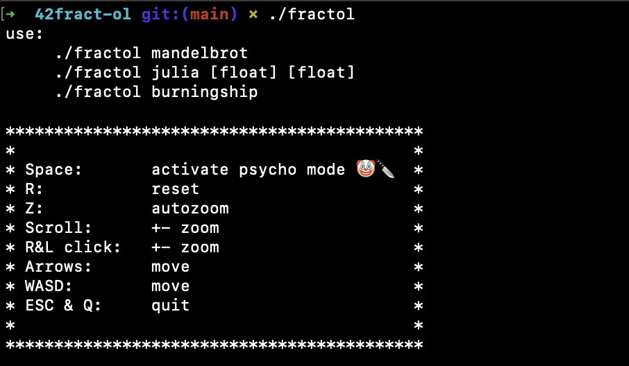

# 42fract-ol

## A psychedelic fractal visualization program


This project is all about creating graphically beautiful fractals.

Through this project I discovered the mathematical notion of complex numberes, graphical optimization and event handling.
It includes the following fractals: the **Mandelbrot** set, the **Julia** set, and the **Burning Ship** set.

This was my fifth project in **Hive Helsinki**, and it was the first graphical project.
I actually completed this task in early **2023**, but I wanted to redo the commit history and make some minor changes.

## 📖 Topics
  - 2D programming
  - Optimization techniques
  - Some maths
  - Graphics

## 🛠️ Langs/Tools
  - C
  - MinilibX
  - Makefile

## 🦉 Getting started

  1. ```git clone https://github.com/kenlies/42fract-ol```
  2. ```cd 42fract-ol```
  3. ```make```
  4. ```./fractol mandelbrot```

     **or**

     ```./fractol julia [float] [float]```

     **or**

     ```./fractol burningship```

     


## 💸 Bonus section

The bonus section was quite straight forward, it included:
  - One more different fractal: (burningship)
  - Zoom follows the mouse position
  - In addition to the zoom, move the view by arrow keys
  - Make color range shift

Once again, no bonus files were needed to complete the bonus.

## 🔨 To improve

Make the program more optimized by using threads. It could benefit from some visual enhancements too. The gifs could have been made lighter in terms of size.

## 🍄 More psych 


